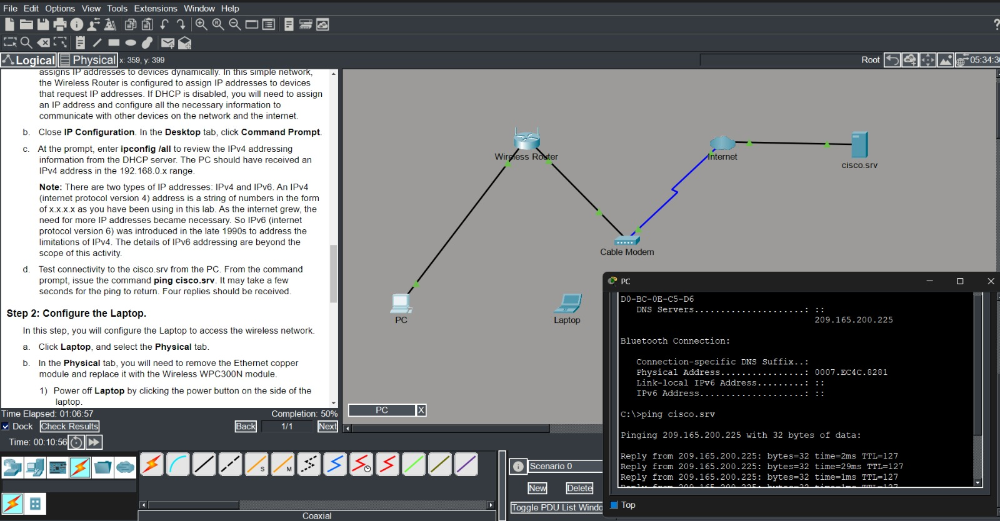
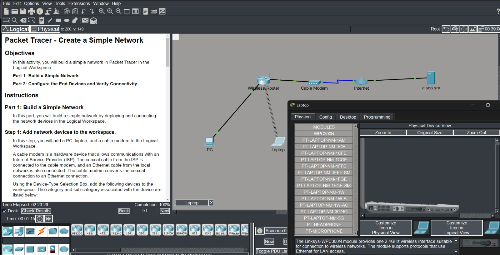
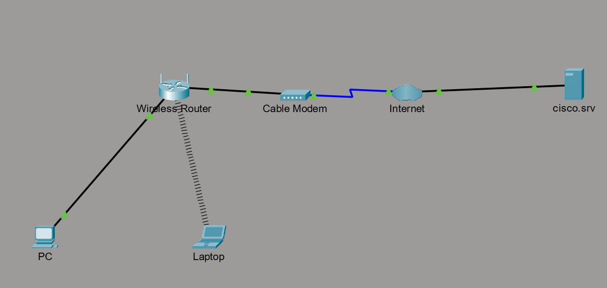
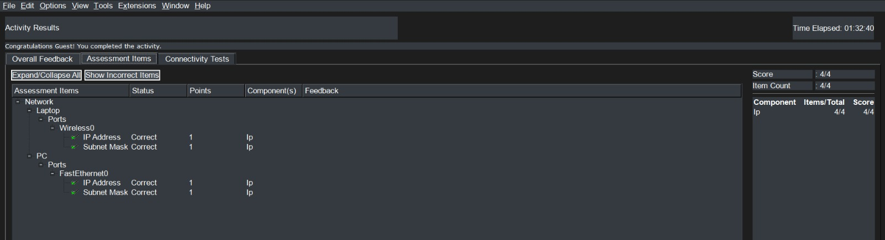

# 🌐 Build a Small Network — My First Networking Project

> **Course:** Getting Started with Cisco Packet Tracer | Cisco Networking Academy
> **Score:** 🏆 4/4 Perfect | **Completed:** 22 June 2026

---

## 💡 About This Project

> *"From zero to network — one ping at a time."* 🚀

My **very first hands-on networking project**, completed as part of the *Getting Started with Cisco Packet Tracer* course on **Cisco Networking Academy (NetAcad)**.

I build a complete **home network from scratch** — entirely inside Cisco Packet Tracer, with no real hardware needed.


⚙️ **What I did:**

  -  Connected devices using Ethernet and Coaxial cables
  -  Enabled DHCP for automatic IP assignment
  -  Swapped the Laptop's Ethernet NIC for a **WPC300N Wireless Module**
  -  Connected Laptop wirelessly to **HomeNetwork** SSID
  -  Verified connectivity with `ping cisco.srv` — **4/4 replies received!**
  -  Browsed to `cisco.srv` via Web Browser from the Laptop
  
🏆 **Final Score: 4/4 — Perfect!**

---

## ✨ What Inspired Me

-  **The Big Question:** 
I have always wondered — *how does a message typed on one device reach another device across the world in milliseconds?* That question never left me.


-  **The Discovery:**
When I found out that **Cisco NetAcad** offers free beginner courses with real simulation tools, I knew this was exactly where I needed to start my journey.


-  **The Moment Everything Clicked:** 
This project was my first real taste of *doing* rather than just *reading*. The moment I ran `ping cisco.srv` and saw:
  ```
  Reply from 209.165.200.225: bytes=32 time=2ms TTL=127  ✅
  Reply from 209.165.200.225: bytes=32 time=1ms TTL=127  ✅
  Reply from 209.165.200.225: bytes=32 time=1ms TTL=127  ✅
  Reply from 209.165.200.225: bytes=32 time=29ms TTL=127 ✅
  ```
  …I felt something shift. **4 out of 4 replies.** It was the moment I realized: *I can actually do this.*

- 💙 **What keeps me going:** That feeling of building something that actually works — and knowing this is only the beginning of a much bigger journey into networking and cybersecurity.

---

## 📸 Project Screenshots

### 1️⃣ Connect PC — Practical (Step 1)
> Configured the PC, ran `ipconfig /all` to verify DHCP-assigned IP, then successfully pinged `cisco.srv` — **4/4 replies received!** Completion: 50%



---

### 2️⃣ Connect Laptop Wirelessly — Practical (Step 2)
> Replaced Ethernet NIC with WPC300N wireless module, connected Laptop to **HomeNetwork** SSID, browsed to `cisco.srv` via Web Browser. Completion: **100%** ✅



---

### 3️⃣ Final Network Topology — Project Complete
> The completed network showing all devices connected: PC (wired), Laptop (wireless), Wireless Router, Cable Modem, Internet Cloud, and cisco.srv



---

### 4️⃣ Activity Results — Perfect Score 4/4 🏆
> Assessment results from Cisco Packet Tracer: IP Address ✅ and Subnet Mask ✅ correct for both Laptop (Wireless0) and PC (FastEthernet0). **Score: 4/4**



---

## 🗺️ Network Topology Diagram

```
[PC] ──Ethernet──► [Wireless Router] ──Coaxial──► [Cable Modem] ──► [Internet] ──► [cisco.srv]
                          │
                    (Wi-Fi 📶)
                          │
                      [Laptop]
```

### Devices Used

| Device | Role | Connection Type |
|---|---|---|
| 🖥️ PC | Wired client | Copper Ethernet |
| 💻 Laptop | Wireless client | Wi-Fi — WPC300N Module |
| 📡 Wireless Router | DHCP Server + Gateway | LAN + WAN |
| 📦 Cable Modem | ISP connection | Coaxial Cable |
| 🌐 Internet Cloud | WAN simulation | — |
| 🖧 cisco.srv | Remote web server | — |

---

## 🛠️ Special Features

### 🔌 Dual Connectivity — Wired + Wireless
Both wired (PC via Ethernet) and wireless (Laptop via WPC300N) connections working **simultaneously** on the same network — just like a real home setup.

### ⚙️ DHCP Auto-Configuration
The Wireless Router acts as a **DHCP server**, automatically assigning IP addresses, subnet masks, default gateways, and DNS to all devices — no manual configuration needed.

### 🌐 End-to-End Connectivity Verified
- **Layer 3 (Network):** `ping cisco.srv` → 4/4 replies ✅
- **Layer 7 (Application):** Web browser on Laptop navigated to `cisco.srv` ✅

### 📊 Perfect Assessment Score — 4/4
Cisco Packet Tracer's built-in grading system verified all IP addresses and subnet masks — **perfect score achieved!**

---

## ⚔️ Challenges I Faced

### 1.  Wireless Module Swap
The trickiest part was replacing the Laptop's Ethernet NIC with the WPC300N wireless module:
- Must **power OFF** the Laptop first — changes are blocked while it's on
- Drag the Ethernet module out of the slot
- Drag the WPC300N module in from the Modules panel
- Power ON again and connect to Wi-Fi

> 💡 Missing the power-off step is a classic beginner mistake — I learned it the hard way!

### 2.  Understanding Cable Types
Confused at first about which cable connects which devices:
- **Copper Straight-Through** → PC to Router
- **Coaxial** → Router to Cable Modem
- **Wireless** → No cable at all!

> Wrong cable = failed connection. Getting this right was a key early lesson.

### 3.  Understanding DHCP vs Static IP
I didn't understand why IP addresses appeared automatically. Learning the **DORA process** (Discover → Offer → Request → Acknowledge) was a real breakthrough.

### 4.  Reading ipconfig /all Output
The output has many fields — learning what each one means (Physical Address, IPv4, Subnet Mask, Default Gateway, DHCP Server, DNS) helped everything click into place.

---

## 📂 Repository Contents

```
📁 CCNA-Networking/
└── 📁 Cisco Packet tracer/
    │
    ├── 📁 Build_a_Small_Network_Project/
    │   ├── 🖼️  1.Connect_PC_Practical_screenshot.jpeg              ← PC config & ping test
    │   ├── 🖼️  2.Connect_Laptop_Wireless_Practical_screenshot.jpeg ← Laptop wireless setup
    │   ├── 🖼️  3.Project_Complete--Topology.jpeg                   ← Final network topology
    │   ├── 🖼️  4.Project_Result_Score.jpeg                         ← Assessment score 4/4
    │   ├── 📦  Create a Simple Network.pka                         ← Packet Tracer activity file
    │   ├── 📄  Packet_Tracer-Create_a_Simple_Network_project_Guide.pdf ← Project guide
    │   └── 📝  README.md                                           ← Project documentation
    │
    ├── 📁 Notes_&_Practical/
    │   ├── 📦  1.1.6-packet-tracer-tutored-activitys-logical-and-physical-mode-exploration.pka
    │   ├── 📘  Cisco_Packet_Tracer—File_Types_Notes.md             ← File types notes
    │   ├── 📦  Logical and physical mode activity.pka              ← PT activity file
    │   ├── 📝  Notes.md                                            ← Course notes
    │   └── 📦  i408837v1n1_Packet_Tracer_Quiz.pka                 ← Quiz activity file
    │
    ├── 📜  Certificate of Getting_Started_with_Cisco_Packet_Tracer.pdf ← Official certificate
    ├── 🌐  Certificate.html                                        ← Visual certificate showcase
    └── 📝  Readme.md                                               ← Main course README
```

---

## 📚 What I Learned

-  Connecting devices using Ethernet, Coaxial, and Wireless connections
-  Configuring wired and wireless network clients
-  Understanding DHCP and automatic IP assignment
-  IPv4 addressing, subnet masks, and default gateways
-  Using `ipconfig /all` to inspect full network settings
-  Testing connectivity with `ping` command
-  Verifying web access through a browser
-  Swapping hardware modules in Packet Tracer
-  Understanding Star network topology
-  Learning Packet Tracer file types (.pka, .pkt, .pksz, .pkz)

---

## 🏅 Certificate

> - 🎓 Issued by **Cisco Networking Academy** | Lynn Bloomer, Director
> - 📅 Date: **22 June 2026** 
> - 🆔 Cert ID: `46a8be14-6dfd-48f7-a9ed-07c0a74d1cac`

👉 [View Certificate Visually](https://github.com/noorulnisa416/CCNA-Networking/blob/main/Cisco%20Packet%20tracer/Certificate%20of%20Getting_Started_with_Cisco_Packet_Tracer.pdf)

---

## 👩‍💻 About Me

Hi! I'm ***NOOR UL NISA***, a student of BSIT at **Virtual University of Pakistan**, on a journey into the world of **Networking, Cybersecurity, and Information Technology**.

I came to GitHub because I believe in **learning in public** — sharing my projects, notes, and progress so that others who are just starting out can see that it is okay to begin from zero. Every expert was once a beginner, and this repository is proof of my commitment to grow every single day.

### 🎯 My Goals
-  Earn my **Cisco CCNA Certification**
-  Build expertise in **Cybersecurity**
-  Explore **Cloud Networking** (AWS, Azure)
-  Build and document real-world networking projects
-  Inspire other students — especially **women in tech**

### 🚀 What Brings Me to GitHub
I want this profile to be my **living portfolio** — a record of everything I learn, build, and achieve. Every commit is a step forward. Every project is a new skill. I want future employers, collaborators, and fellow learners to see someone who is **serious, consistent, and passionate** about technology.

**This is just the beginning.** 💙

---

## 🔗 Connect With Me

| Platform | Link |
|---|---|
| 🌐 GitHub | [github.com/noorulnisa416](https://github.com/noorulnisa416) |
| 💼 LinkedIn | *https://www.linkedin.com/in/noorulnisa416/* |
| 🏫 NetAcad | Cisco Networking Academy |

---

## 🚀 What's Next

- [ ] Complete **CCNA 1 — Introduction to Networks**
- [ ] Build a **multi-switch LAN** topology
- [ ] Configure **VLANs** and inter-VLAN routing
- [ ] Learn **subnetting** and CIDR notation
- [ ] Explore **Cybersecurity Essentials** course
- [ ] Document every project here on GitHub 📁

---

> *"Every great network engineer started somewhere — and this is where my journey begins."* 🌐💙

---
*⭐ If this project inspired you or helped you, consider giving it a star — it means the world to a beginner!*
